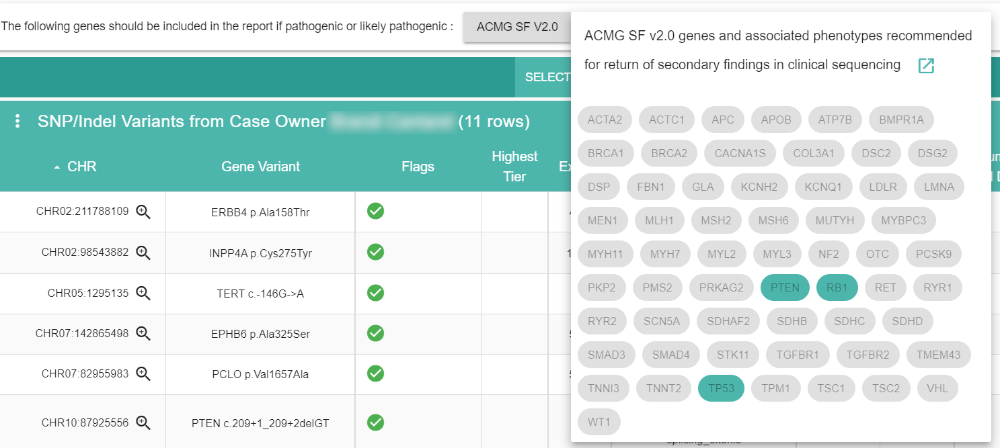

.. _annotations:

Annotations
===========

This is an experimental section of Answer. Some features like editing or creating annotations may or may not be available yet.

The annotations page groups ways to search clinical trials, annotations and gene sets outside of a case.

**Clinical Trials**: you can search through all clinical trials that have been imported as part working on a case.

**SNP / Indel**: since the number of annotations for snps and indels can be quite large, you first need to filter results by gene symbol.  

**Gene Sets**: the list of gene sets that are available for filtering variants when working on a case. Here you can add and modify gene sets based on your panels or other institution panels (for instance by building a subset).

The ACMG SF v2.0 is also used as part of mandatory reporting of pathogenic or likely pathogenic variants.

